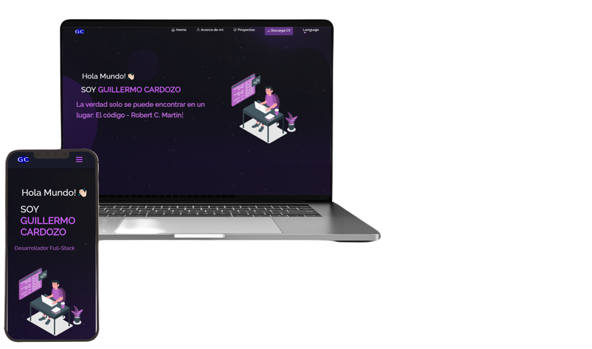

<h2 align="center">
  Portfolio Website - v2.0 
  <a href="https://guillermo-cardozo-portfolio.web.app/" target="_blank">Guillermo Cardozo - Portfolio</a>
</h2>

  

 &nbsp;
 &nbsp;
 &nbsp;

## Desarrollado con

Mi portafolio personal <a href="https://guillermo-cardozo-portfolio.web.app/" target="_blank">Guillermo Cardozo - Portfolio</a> presenta algunos de mis proyectos de GitHub, así como mi currículum y habilidades técnicas. 

Este proyecto fue desarrollado usando estas tecnologías:

- React.js
- Node.js
- Express.js
- CSS3
- VsCode
- Vercel

## Características

**📖 Multi-Page Layout**

**🎨 Diseñado con React-Bootstrap y CSS con colores fáciles de personalizar**

**📱 Totalmente Responsiva**

:star: Lenguajes Español e Inglés disponibles

## Empezando

Clonar este repositorio. Vas a necesitar `node.js` y `git` instalados globalmente en tu PC.

## 🛠 Instalación y configuraciones

1. Instalación: `npm install` o si da error usar `npm install --legacy-peer-deps`

2. En la carpeta donde se encuentra el proyecto, ejecutar `npm start`

Ejecuta la aplicación en el modo de desarrollo.\
Abrir [http://localhost:3000](http://localhost:3000) para visualizarlo en el navegador.
La página se recargará cuando hayan cambios.

## Instrucciones de uso

Abrir la carpeta del proyecto con VSCode y navegar a `/src/components/`.  
Encontraras todos los componentes utilizados y podrás editar la información.
En `/src/locales/` verás 2 carpetas y dentro de estas están los archivos .json que contienen todos los strings en ambos idiomas, es en estos archivos donde debes editar la información.

### Ayudame con una ⭐ si te gustó el proyecto!
